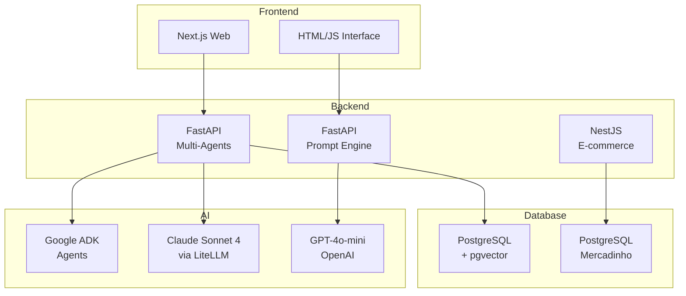

# FullCycle IA Agents

Repository with demonstrative projects developed during **Full Cycle's TechWeek de IA #9**. The projects explore different approaches to AI-assisted software development.

## 🌐🇧🇷 [Versão em Português](README.md)
## 🌐🇺🇸 [English Version](README_EN.md)

## 📖 [Architecture](ARCHITECTURE.md)

---

## 📅 About the Event

**Full Cycle Tech Week: IA for Developers** was a free online event held from **November 24-26**. The event was organized by **Full Cycle Faculty of Technology** and aimed to teach how to apply AI in real-world applications.

### What You Learned

- **Methodologies and workflows** to boost productivity
- **Autonomous Agent development** that make decisions and execute complex processes
- **Advanced Cursor features** for AI-assisted development
- **MCP Servers creation and consumption** (Model Context Protocol)
- **Google ADK (Agent Development Kit)** for building AI agents
- **Docker MCP Toolkit** for integration

### Instructor

**Wesley Willians** - Founder/CEO of Full Cycle

- Degree in Technology and Digital Media from PUC-SP
- Executive MBA in Business Management from Ibmec
- Two specializations from MIT
- Awarded as one of the 100 leaders in education by the "Global Education and Learning Forum"
- Microsoft MVP, Google Developer Expert, Docker Captain

### Certificate

Participants received a free course certificate with **10 hours** of workload from Full Cycle Faculty of Technology.

---

## 📁 Included Projects

This repository contains 3 independent projects:

### 1. 🔍 Multi-Agents RAG (techweekia9-multi-agents-rag-main)

Multi-agent system for analyzing legal cases using **RAG (Retrieval-Augmented Generation)** with vector semantic search.

**Tech Stack:**
- Backend: Python 3.12, FastAPI, Google ADK, LiteLLM
- Frontend: Next.js 14, React 18, TailwindCSS
- Database: PostgreSQL 16 + pgvector
- LLM: Claude Sonnet 4 (Anthropic) via LiteLLM

**Features:**
- Specialized agents (Research, Jurisprudence, Analysis)
- Semantic search with Gemini embeddings
- Interactive chat with legal context

### 2. 📝 Prompt Engineering (techweekia9-prompt-main)

Interactive web application demonstrating different **prompt engineering techniques** by comparing results using the same model.

**Tech Stack:**
- Backend: Python, FastAPI
- Frontend: HTML/CSS/JS
- LLM: GPT-4o-mini (OpenAI)

**Techniques demonstrated:**
- Zero-shot prompting
- Chain of Thought (CoT)
- Tree of Thoughts (ToT)
- ReAct (Reasoning + Action)

### 3. 🛒 FullCycle Mercadinho (techweekia9-dev-com-ia-main)

B2C e-commerce API built with **NestJS** demonstrating AI-assisted development with coding agents.

**Tech Stack:**
- Framework: NestJS 11, TypeScript
- Database: PostgreSQL 16, TypeORM
- Infrastructure: Docker
- Payments: Stripe

**Features:**
- Product catalog
- JWT authentication
- Shopping cart
- Email notifications

---

## 📊 General Architecture



---

## 🛠️ Prerequisites

- [Docker](https://docs.docker.com/get-docker/) and Docker Compose
- Python 3.10+ (for Python projects)
- Node.js 18+ (for NestJS project)
- API Keys:
  - Anthropic (Claude)
  - Google AI (Gemini)
  - OpenAI

---

## 🚀 How to Run Each Project

### Multi-Agents RAG

```bash
cd techweekia9-multi-agents-rag-main
cp services/agents/.env.example services/agents/.env
# Configure API keys in .env
docker compose up

# In another terminal, ingest data:
docker compose exec agents bash
python -m ingestion.ingest
```

Access: http://localhost:3000

### Prompt Engineering

```bash
cd techweekia9-prompt-main
python -m venv venv
source venv/bin/activate  # or venv\Scripts\activate on Windows
pip install -r requirements.txt
echo "OPENAI_API_KEY=sk-..." > .env
uvicorn main:app --reload
```

Access: http://localhost:8000

### FullCycle Mercadinho

```bash
cd techweekia9-dev-com-ia-main
docker compose up -d
docker compose exec nestjs-api npm install
docker compose exec nestjs-api npm run start:dev
```

Access: http://localhost:3000

---

## 📚 Repository Structure

```
Fullcycle-Ia-Agents/
├── techweekia9-multi-agents-rag-main/
│   ├── services/
│   │   ├── agents/          # Python Backend (FastAPI + Google ADK)
│   │   └── web/             # Next.js Frontend
│   ├── db/                  # PostgreSQL schema + pgvector
│   ├── docker-compose.yml
│   └── README.md
│
├── techweekia9-prompt-main/
│   ├── routes/              # FastAPI endpoints
│   ├── prompts.py           # Prompts by technique
│   ├── techniques.py        # Reasoning engines
│   ├── main.py              # Server
│   └── frontend.html        # Interface
│
├── techweekia9-dev-com-ia-main/
│   ├── src/                 # NestJS code
│   ├── test/                # E2E tests
│   ├── docs/                # Documentation (PRD)
│   ├── CLAUDE.md            # Agent guidelines
│   └── compose.yaml
│
├── ideas.txt                # Event information
└── README.md               # This file
```

---

## 🌐 Deploy

### Multi-Agents RAG
Recommended deployment using Docker Compose on Linux server. For production, consider:
- Replace mock data with real database
- Configure API authentication
- Use managed PostgreSQL service

### Prompt Engineering
Can be deployed on any platform supporting Python:
- Render, Railway, Fly.io
- AWS Lambda + API Gateway

### FullCycle Mercadinho
Deploy on container or PaaS:
- AWS ECS/Fargate
- Google Cloud Run
- Azure Container Apps

---

## 📝 License

This project is part of educational materials from [Full Cycle](https://fullcycle.com.br).

---

**Last Updated:** 30/03/2026
**Version:** 1.0.0
**Maintainer:** Felipe Moreira
